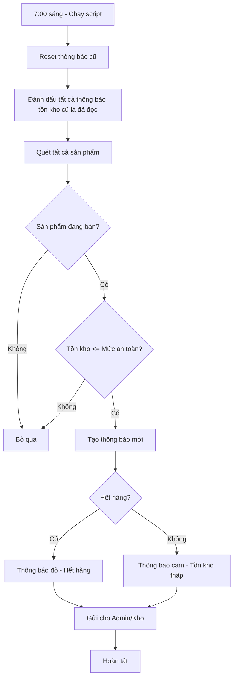
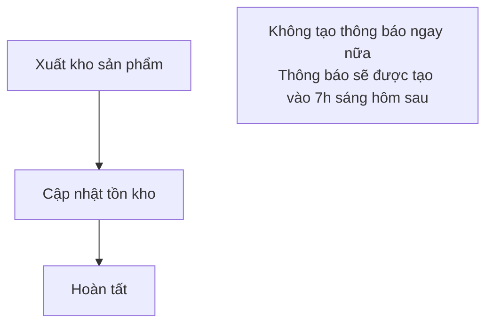

# Hệ thống Cảnh báo Tồn kho Tự động

## 📋 Tổng quan

Hệ thống tự động kiểm tra và gửi thông báo cho các sản phẩm có tồn kho thấp hoặc hết hàng **mỗi ngày lúc 7:00 sáng**.

### ✨ Tính năng chính

- ✅ **Reset thông báo hàng ngày**: Đánh dấu thông báo cũ là đã đọc mỗi sáng
- ✅ **Tạo thông báo mới**: Gửi cảnh báo mới cho tất cả sản phẩm vẫn còn tồn kho thấp
- ✅ **Chỉ cảnh báo sản phẩm đang bán**: Không gửi thông báo cho sản phẩm đã ẩn (is_active = 0)
- ✅ **Phân loại theo mức độ nghiêm trọng**:
  - 🔴 **Hết hàng** (qty = 0): Thông báo đỏ
  - 🟠 **Tồn kho thấp** (qty <= safety_stock): Thông báo cam

### 🎯 Người nhận thông báo

- Admin (role_id = 2)
- Quản lý (role_id = 3, 4)
- Nhân viên kho (staff_role = 'Kho')

---

## 🚀 Cài đặt

### 1. Chạy Migration (nếu chưa)

```bash
mysql -u root -p mini_market < database/migrations/add_notifications.sql
```

### 2. Kiểm tra file đã tạo

Đảm bảo các file sau đã tồn tại:

```
CT550/
├── daily_stock_check.php          # Script PHP chính
├── daily_stock_check.bat          # Batch file để chạy script
├── src/
│   ├── Services/
│   │   └── DailyStockAlertService.php    # Service kiểm tra tồn kho
│   ├── Controllers/Admin/
│   │   └── StockAlertController.php      # Controller quản lý
│   └── views/admin/
│       └── stock-alerts/
│           └── index.php                  # Trang quản lý
└── logs/
    └── daily_stock_check.log       # Log file (tự động tạo)
```

### 3. Cấu hình Windows Task Scheduler

#### Bước 1: Mở Task Scheduler
- Nhấn `Win + R`, gõ `taskschd.msc`, nhấn Enter
- Hoặc tìm "Task Scheduler" trong Start Menu

#### Bước 2: Tạo Task mới
1. Click **"Create Basic Task..."** ở panel bên phải
2. **Name**: `Daily Stock Alert - 7AM`
3. **Description**: `Kiểm tra tồn kho thấp và gửi thông báo mỗi ngày lúc 7h sáng`
4. Click **Next**

#### Bước 3: Trigger (Khi nào chạy)
1. Chọn **"Daily"** (Hàng ngày)
2. Click **Next**
3. **Start date**: Chọn ngày hôm nay
4. **Recur every**: `1` days
5. **Time**: `07:00:00` (7 giờ sáng)
6. Click **Next**

#### Bước 4: Action (Làm gì)
1. Chọn **"Start a program"**
2. Click **Next**
3. **Program/script**: 
   ```
   C:\Users\Dell\OneDrive\Documents\Course\CT550\daily_stock_check.bat
   ```
4. **Start in**: 
   ```
   C:\Users\Dell\OneDrive\Documents\Course\CT550
   ```
5. Click **Next**

#### Bước 5: Settings (Cài đặt bổ sung)
1. Click **Finish**
2. Chuột phải vào task vừa tạo → **Properties**
3. Tab **Settings**:
   - ✅ Run task as soon as possible after a scheduled start is missed
   - ✅ If the task fails, restart every: `10 minutes`
   - Attempt to restart up to: `3` times
4. Click **OK**

---

## 🧪 Kiểm tra & Test

### Cách 1: Chạy thủ công từ CMD

```cmd
cd C:\Users\Dell\OneDrive\Documents\Course\CT550
php daily_stock_check.php
```

### Cách 2: Double-click file BAT

Double-click file `daily_stock_check.bat`

### Cách 3: Từ trang Admin

1. Truy cập: `http://localhost/admin/stock-alerts`
2. Click nút **"Chạy Kiểm tra"**
3. Xem kết quả ngay trên trang

### Kiểm tra Log File

Mở file `logs/daily_stock_check.log` để xem lịch sử:

```
[2025-01-17 07:00:01] DAILY STOCK ALERT CHECK STARTED
[2025-01-17 07:00:02] Reset old notifications: 5
[2025-01-17 07:00:03] Out of stock products: 2
[2025-01-17 07:00:03] Low stock products: 8
[2025-01-17 07:00:04] Total notifications created: 30
[2025-01-17 07:00:04] DAILY STOCK ALERT CHECK COMPLETED
```

---

## 📊 Cách hoạt động

### Luồng xử lý hàng ngày (7:00 sáng)



### Luồng xử lý khi xuất kho



> **Lưu ý:** Hệ thống không còn tạo thông báo ngay khi xuất kho nữa để tránh spam. Tất cả thông báo được tạo tập trung vào 7h sáng mỗi ngày.

---

## 🔧 Cấu hình

### Thay đổi thời gian chạy

**Trong Task Scheduler:**
1. Chuột phải vào task → Properties
2. Tab **Triggers** → Double-click trigger
3. Đổi **Time** thành giờ bạn muốn

**Trong code (nếu muốn tùy chỉnh logic):**
- File: `src/Services/DailyStockAlertService.php`
- Method: `runDailyCheck()`

### Thay đổi mức an toàn mặc định

**Trong database:**
```sql
UPDATE stocks SET safety_stock = 20 WHERE product_id = ?;
```

**Hoặc thay đổi mặc định trong migration:**
```sql
ALTER TABLE stocks MODIFY COLUMN safety_stock INT NOT NULL DEFAULT 20;
```

### Thay đổi người nhận thông báo

**File:** `src/Services/DailyStockAlertService.php`

**Dòng 70-74:**
```php
$sqlUsers = "SELECT DISTINCT u.id 
             FROM users u 
             LEFT JOIN staff_profiles sp ON sp.user_id = u.id 
             WHERE u.role_id IN (2, 3, 4)  -- Thêm/bớt role_id
                OR sp.staff_role IN ('Kho', 'Admin')"; -- Thêm/bớt vai trò
```

---

## 📈 API Endpoints

### 1. Chạy kiểm tra thủ công
```http
POST /admin/api/stock-alerts/run-check
```

**Response:**
```json
{
  "success": true,
  "data": {
    "reset_old_notifications": 5,
    "low_stock_products": 8,
    "out_of_stock_products": 2,
    "notifications_created": 30,
    "timestamp": "2025-01-17 10:30:15"
  }
}
```

### 2. Lấy thống kê
```http
GET /admin/api/stock-alerts/stats
```

**Response:**
```json
{
  "success": true,
  "data": {
    "out_of_stock": 2,
    "low_stock": 8,
    "critical": 3,
    "total_issues": 10,
    "active_products": 150,
    "timestamp": "2025-01-17 10:30:15"
  }
}
```

### 3. Dọn dẹp thông báo cũ
```http
POST /admin/api/stock-alerts/cleanup
```

**Response:**
```json
{
  "success": true,
  "deleted": 42
}
```

---

## 🐛 Troubleshooting

### Script không chạy tự động

1. **Kiểm tra Task Scheduler**:
   - Mở Task Scheduler
   - Tìm task "Daily Stock Alert - 7AM"
   - Tab **History** → Xem log chi tiết

2. **Kiểm tra quyền**:
   - Chuột phải task → Properties
   - Tab **General** → Run with highest privileges

3. **Kiểm tra đường dẫn**:
   - Đảm bảo đường dẫn trong Task Scheduler chính xác
   - Thử chạy thủ công bằng double-click file BAT

### Không nhận được thông báo

1. **Kiểm tra sản phẩm**:
   ```sql
   SELECT * FROM products WHERE is_active = 0;
   ```
   → Chỉ sản phẩm `is_active = 1` mới được cảnh báo

2. **Kiểm tra tồn kho**:
   ```sql
   SELECT p.name, s.qty, s.safety_stock 
   FROM stocks s 
   JOIN products p ON p.id = s.product_id 
   WHERE s.qty <= s.safety_stock AND p.is_active = 1;
   ```

3. **Kiểm tra thông báo**:
   ```sql
   SELECT * FROM notifications 
   WHERE title LIKE '%tồn kho%' 
   ORDER BY created_at DESC 
   LIMIT 10;
   ```

### Log file không tạo

1. **Tạo thư mục logs thủ công**:
   ```cmd
   mkdir logs
   ```

2. **Kiểm tra quyền ghi**:
   - Chuột phải thư mục `logs` → Properties → Security
   - Đảm bảo user có quyền Write

---

## 📝 Lưu ý quan trọng

### ⚠️ Điều kiện cảnh báo

- ✅ Chỉ sản phẩm **đang bán** (is_active = 1)
- ✅ Tồn kho **<= mức an toàn** (qty <= safety_stock)
- ✅ Reset thông báo **mỗi ngày** lúc 7h sáng

### 🔄 Chu kỳ làm việc

1. **7:00 sáng mỗi ngày**:
   - Reset tất cả thông báo cũ (đánh dấu đã đọc)
   - Tạo thông báo mới cho sản phẩm vẫn còn tồn kho thấp
   - **Đây là cách duy nhất tạo thông báo tồn kho** (tránh trùng lặp)

2. **Khi xuất kho**:
   - Chỉ cập nhật số lượng tồn kho
   - **Không tạo thông báo** (thông báo sẽ được tạo vào 7h sáng hôm sau)

3. **Chủ nhật hàng tuần**:
   - Xóa thông báo cũ đã đọc (> 30 ngày)

### 💡 Best Practices

- Kiểm tra log file định kỳ để đảm bảo script chạy đúng
- Điều chỉnh `safety_stock` phù hợp với từng sản phẩm
- Ẩn sản phẩm không còn kinh doanh (set `is_active = 0`)

---

## 📞 Hỗ trợ

Nếu gặp vấn đề, kiểm tra:
1. Log file: `logs/daily_stock_check.log`
2. PHP error log: `logs/error.log`
3. Task Scheduler History

---

**Phiên bản:** 1.0  
**Ngày cập nhật:** 18/10/2025  
**Tác giả:** MiniGo Development Team
